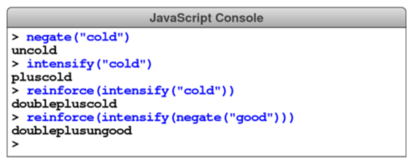

# CHALLENGE 5

### _"It is a beautiful thing, the destruction of words."_
 —Syme in George Orwell’s 1984

 In Orwell’s novel, Syme and his colleagues at the Ministry of Truth are engaged in simplifying English into a more regular language called Newspeak. As Orwell describes in his appendix entitled “The Principles of Newspeak,” words can take a variety of prefixes to eliminate the need for the massive number of words we have in English. For example, Orwell writes,

 > Any word—this again applied in principle to every word in the language—could be negatived by adding the affixun-, or could be strengthened by the affix plus-, or, for still greater emphasis, doubleplus-. Thus, for example, uncold meant “warm,” while pluscold and doublepluscold meant, respectively, “very cold” and “superlatively cold.”

 Define three functions— `negate`, `intensify`, and `reinforce` —that take a string and add the prefixes "un", "plus", and "double" to that string, respectively. Your function definitions should allow you to generate the following console session:

 
